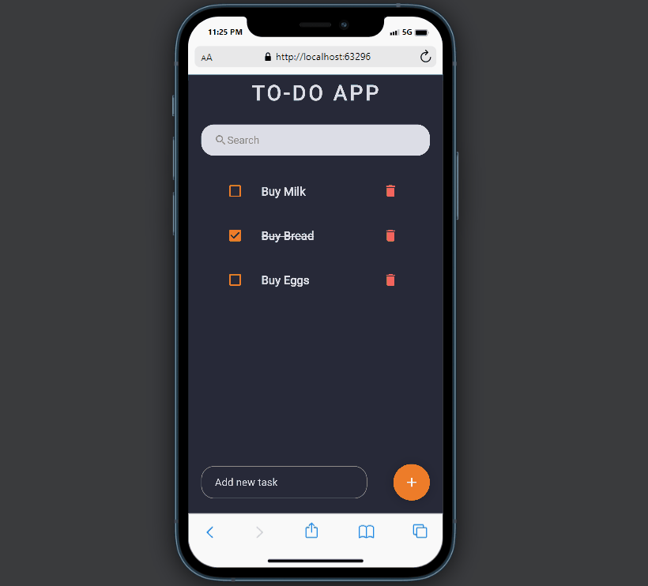

# Flutter Tasks App

A Flutter app that allows users to create, search and view a list of tasks.




# Application Architecture

```
lib/
|-- constants/
|   |-- colors.dart
|
|-- model/
|   |-- todo.dart
|
|-- screens/
|   |-- home.dart
|
|-- widgets/
|   |-- home.dart
|
|-- main.dart
```

Here's a brief description of each folder:

1. **constants/:** This folder contains files that define constants used throughout the app. In this case, there's a ``colors.dart`` file that defines color constants that can be used in various parts of the app.
2. **model/:** This folder contains files that define the data model used in the app. In this case, there's a ``todo.dart`` file that defines the Task class used to represent a task in the app.
3. **screens/:** This folder contains files that define the screens or views used in the app. In this case, there's a ``home.dart`` file that defines the home screen of the app.
4. **widgets/:** This folder contains files that define reusable widgets used throughout the app. In this case, there's a `todo_item.dart` file that defines a custom widget used to display a single task in a list
5. **main.dart:** This file is the entry point for the app and defines the top-level MyApp widget that contains the app's overall structure.

# Running the Flutter App on VSCode

1. **Clone the repository**

   ```
   git clone <repository url>

   ```
2. **Open the cloned folder in VSCode:**

   ```
   cd <repository folder>
   code .

   ```
3. **Install dependencies:**

   ```
   flutter pub get

   ```
4. **Start the app:**

   ```
   flutter run

   ```

   **This will launch the app on the default emulator or connected device**

# Testing the Flutter App on VSCode

1. **To run tests, use the following command:**

   ```
   flutter test
   ```
2. **You can also run individual tests by specifying the test file or test method name:**

   ```
   flutter test <test file>

   ```
   **Congratulations! You've successfully run and tested your Flutter app locally using VSCode.**
